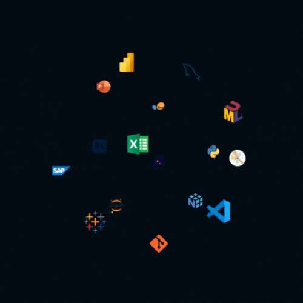

<b>Data & AI Engineer</b> · Geneva area 🇨🇭🇫🇷 I build data pipelines, scrapers and AI agents that turn raw data into something people (and LLMs) can actually use.

  
  

  

> [!NOTE]
> **Since 2024, most of my work lives on GitLab** (private repositories at work), so this profile shows only a small part of what I build day to day.

---

## 🌱 About Me

I'm Yohan, a Data & AI Engineer at **DLG / Luxtech** (Geneva), where I design the data and AI infrastructure behind market intelligence for the luxury industry.

I came to data after 9 years in retail, then an ENSAE Paris Master's and a Google Data Analytics certificate. That field experience still shapes how I work: I start from the business question, ship a working POC fast, then make it production-ready.

Off screen, you'll find me bouldering, freediving, hiking or on my motorbike 🏍️.

---

## 🧐 What I'm working on

- 🕸️ **Large-scale scraping**: a fleet of 200+ scrapers orchestrated on Cloud Run
- 🏗️ **Data architecture**: Medallion layers (Bronze / Silver / Gold) on BigQuery, with semantic layers for analysts and AI agents
- 🤖 **Agentic AI**: designing and building secure MCP servers and multi-agent systems (Google ADK, CrewAI, Claude Agent SDK) for classification, OCR and auto-scraping
- ✅ **Data quality**: automated checks mixing deterministic rules and ML/LLM

---

## 🛠️ Tech stack
<table align="center">
<td>
  <ul>
    <li><b>Languages</b>: Python, SQL, Bash</li>
    <li><b>Data & Cloud (GCP)</b>: BigQuery, Cloud Run, Cloud Functions, Pub/Sub, Eventarc, GCS, dbt, Dataform, ClickHouse, Kafka</li>
    <li><b>AI & Agents</b>: MCP / FastMCP, A2A, Google ADK, CrewAI, Claude Agent SDK, Vertex AI, RAG</li>
    <li><b>Scraping</b>: Playwright, BeautifulSoup, proxies, TLS fingerprinting</li>
    <li><b>DevOps</b>: Docker, GitLab CI (self-hosted runners, Kaniko), Git</li>
    <li><b>BI & Viz</b>: Looker, Power BI, Streamlit, Plotly</li>
  </ul>
</td>
<td></td>
</table>

